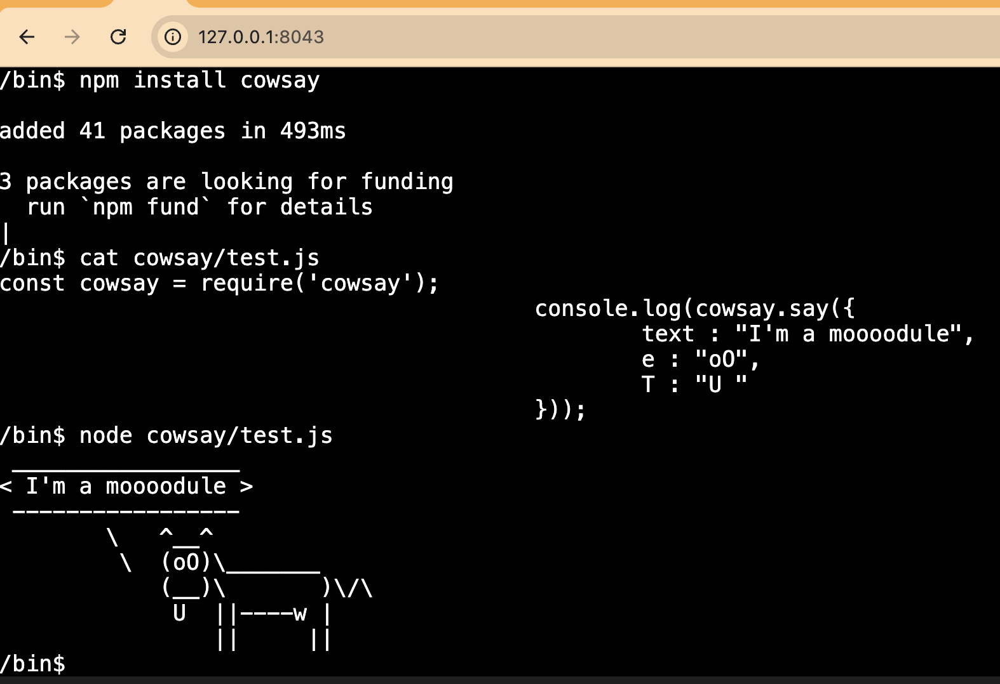

## Node.js Runtime in the browser

Node.js standard library built for web browsers!



### Why?

I wanted to support webpack in [WordPress Playground](http://w.org/playground), but it requires a
Node.js runtime. All the existing libraries seem to be polyfilling entire Node.js core modules such
as `fs`, `http`, `crypto`, etc. This is useful for simple use-cases, but Node.js modules are large
and nuanced.

This project is different. It ships the actual Node.js core library with browser-specific
polyfills for system calls. It's an exploratory project to see how far we can go. The
approach seems very viable! It still requires a lot more work to correctly support all
the internal syscalls, the initialization flow, actual Worker with shared filesystem etc.
but even without those features, it can already run `npm`, build TypeScript, etc.

### Setup instructions

1. `git clone --recurse-submodules git@github.com:adamziel/node-js-in-the-browser.git`
2. `cd node/lib/internal; ln -s ../../deps ./`
3. `npm install build.js`
4. `node build.js`
5. Start a local server with CORS proxy: `frankenphp run --config ./frankenphp.Caddyfile` or `php -S 8043`
6. Go to http://127.0.0.1:8043/ and enjoy

### Examples

Run these in the XTerm shell at http://127.0.0.1:8043/.

**There's a big gotcha with CWD!** Once you run `npm` for the first time, node CWD will be
stuck in your current `cwd`! This means you must refresh the page before going to another
demo and running `npm install` there! This will be fixed in the future.

Also! The terminal will not always show you the prompt once it's ready for interactions! If
your command finished, just press enter again and you'll be back in the interactive shell!

#### Hello world

```
node hello.js
```

#### Cowsay

```
cd demo-cowsay
npm install
node test.js
```

#### Webpack

```
cd demo-ts
npm install --verbose
node ./node_modules/.bin/webpack build
ls dist
cat dist/bundle.js
```

#### TypeScript

### Running tests

Follow the setup steps and go to http://127.0.0.1:8043/tests.html to run the tests.

Future improvements:

* Run the actual Node.js test suite.
* Fix any failing tests, document the limitations when a fix is not possible.
